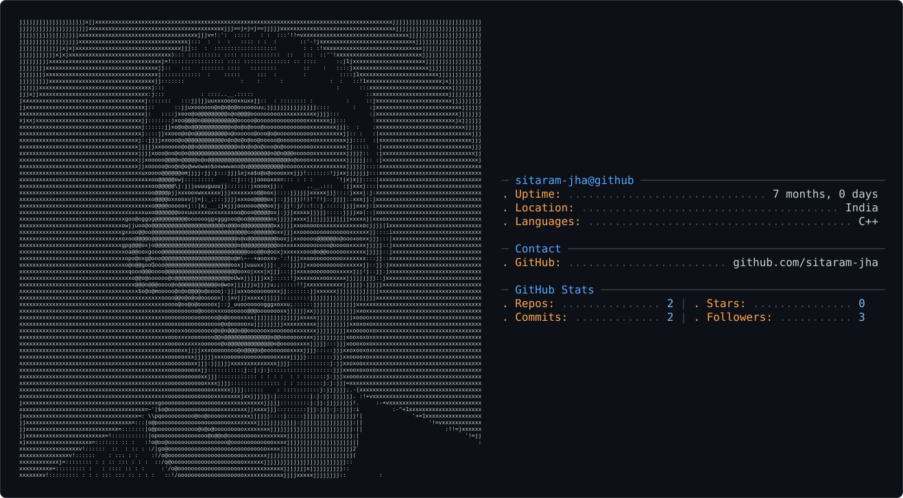

<picture>
  <source media="(prefers-color-scheme: dark)" srcset="dark_mode.svg" />
  <source media="(prefers-color-scheme: light)" srcset="light_mode.svg" />
  
</picture>


# 👋 Hey, I'm **Sitaram Jha**

<p align="center">
  
</p>

<p align="center">
  <em>💻 Building • Learning • Debugging • Improving</em>
</p>

---

## 🚀 About Me

I'm an **Aspiring Software Engineer** who enjoys learning by building projects and understanding how things work under the hood.

I'm currently focused on strengthening my **C++ fundamentals, OOP, and DSA**, while also exploring **Web Development, APIs, and Backend Development**.

### 🧠 What I'm Currently Doing

* 🔥 Learning **C++ & Data Structures and Algorithms**
* 🏗️ Building **real-world projects**
* 🌐 Exploring **Node.js, React, APIs & JSON**
* 🧩 Improving my **problem-solving skills**
* 🛠️ Learning through **projects, debugging & experimentation**
* 🚀 Continuously exploring new technologies

---

## 🛠️ Tech Stack & Tools

<p align="left">


</p>

---

## 📌 What You'll Find Here

```text
💻 C++ Projects
🧠 DSA & Problem Solving
🏗️ OOP Projects
🌐 Web Development
🔌 APIs & Backend
📚 Learning Projects
```

---

## 🎯 My Learning Philosophy

> **Code → Build → Break → Debug → Improve → Repeat 🔁**

I believe the best way to learn programming is to **build things, make mistakes, understand why they happen, and improve from them.**

---

<p align="center">
  ⭐ Thanks for visiting my profile!
</p>

<p align="center">
  <b>Let's build something awesome 🚀</b>
</p>

